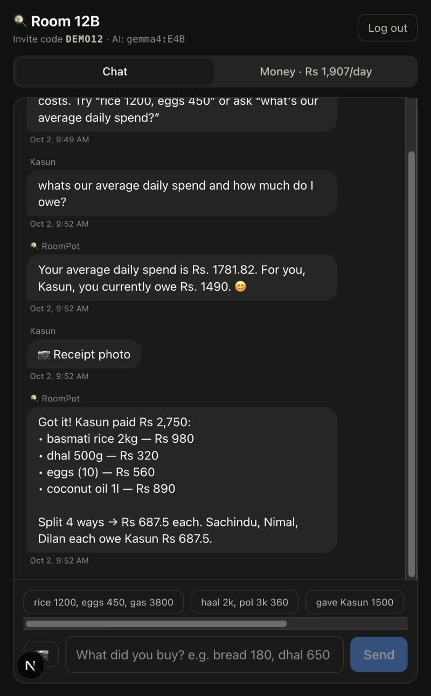
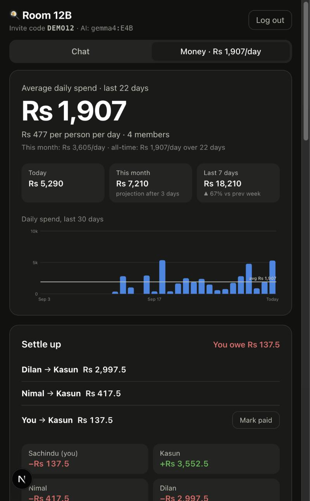

# 🍳 RoomPot

**A shared room budget for roommates who cook together.** Tell the group chat what you bought, like *"rice 1200, eggs 450, gas 3800"* or *"haal 2k, pol 3k 360"*, or send a photo of the bill. An open-weight model (Gemma) reads it, either **inside each roommate's own browser** or on your own machine through Ollama. It logs the cost under whoever is logged in, splits it between the room, and keeps a running tally of who owes whom. No more "machan, did I give you money for the gas last week?"

<p align="center">
  
  &nbsp;
  
</p>

## Why it exists

Four of us share a room and cook together. Whoever goes to the shop pays, and at the end of the month we add it all up and divide by four. Except someone always forgets to write a purchase down, and someone else forgets to collect. RoomPot puts the bookkeeping where we already talk, in a chat, so logging a purchase takes five seconds.

## Features

- **Chat to log costs** in English, Sinhala or Singlish. The model pulls out items and prices, and understands shorthand like `1.2k`, `450/=` and `pol 3k 360` (three coconuts for 360).
- **Automatic payer**: the person logged in is the payer. *"Kasun bought bread 200"* credits Kasun instead.
- **Partial splits**: *"shampoo for me and Nimal 800"* only splits between the two of you.
- **Runs on your phone**: in browser mode, Gemma 2 2B runs on the phone's GPU with [WebLLM](https://github.com/mlc-ai/web-llm). There's no AI server, and messages never leave the device.
- **Receipt photos**: snap the shop bill. In browser mode [Tesseract.js](https://github.com/naptha/tesseract.js) reads it on the phone and Gemma picks out the items; with Ollama, Gemma's vision reads it directly. Totals, cash and change are skipped.
- **Average daily spend**: a rolling 30-day average for the room and per person, plus today, this month (with a projection), last 7 days versus the week before, and a 30-day daily spend chart.
- **Settle up**: balances for every member and the fewest payments that clear all debts, with a *Mark paid* button. You can also just say *"gave Kasun 1500"* in the chat.
- **Ask questions**: *"how much did we spend on gas?"*, *"how much do I owe?"*, answered from the room's own data.
- **Keeps working offline**: if the model is unavailable, a rule-based parser still logs `item price` messages.
- Invite code to join a room, works on phones, light and dark mode.

## Why open models

- **Our money stays with us.** Who bought what and who owes whom is private. In browser mode, each message and receipt photo is processed on the phone that sent it; the server only receives the extracted items and amounts. Nothing goes to a third-party AI API.
- **Free to run.** No per-message bill for a tool that gets used ten times a day.
- **Swap or tune the model.** One environment variable switches between Gemma sizes, any other Ollama model, or a hosted open model. The prompt is plain text in [`src/lib/parse.ts`](src/lib/parse.ts) and can be adjusted for your own language and slang.

## AI modes

| `LLM_PROVIDER` | Where Gemma runs | Good for |
|---|---|---|
| `browser` | On each person's phone or laptop (WebLLM + WebGPU). One-time download of about 1.4 GB, cached afterwards. | Public hosting at no cost, best privacy |
| `ollama` | On your own computer (default `gemma4:E4B`, can read receipt photos directly) | Running it at home on a laptop |
| `openai` | Any OpenAI-compatible server hosting an open model | When phones are too old for WebGPU |

Browser mode needs WebGPU: recent Chrome or Edge on Android, Windows, macOS or ChromeOS, or Safari on iOS 26+. Devices without it fall back to a rule-based parser that still understands `item price` messages and receipt lines.

## Run it locally

You need Node 20+, MongoDB and [Ollama](https://ollama.com).

```bash
ollama pull gemma4:E4B          # or gemma3:4b on smaller machines
git clone https://github.com/Sachindu-Nethmin/roompot.git
cd roompot
npm install
cp .env.example .env.local      # adjust if needed
npm run dev
```

Open http://localhost:3000, sign up, create a room, and share the invite code with your roommates. To let them use it from their phones on the same Wi-Fi, open `http://<your-laptop-ip>:3000`.

Want to see it with data? `npm run seed:demo` creates **Room 12B** with three weeks of cooking costs. Log in as `sachindu`, `kasun`, `nimal` or `dilan` with password `demo1234`.

## Configuration

| Variable | Default | Notes |
|---|---|---|
| `MONGODB_URI` | `mongodb://127.0.0.1:27017/roompot` | Local MongoDB or MongoDB Atlas |
| `SESSION_SECRET` | dev value | Set a long random string in production |
| `LLM_PROVIDER` | `ollama` | `ollama` or `openai` (any OpenAI-compatible server) |
| `LLM_BASE_URL` | `http://127.0.0.1:11434` | Ollama URL, or e.g. `https://generativelanguage.googleapis.com/v1beta/openai` |
| `LLM_MODEL` | `gemma4:E4B` | e.g. `gemma3:4b`, `gemma-3-27b-it` |
| `LLM_API_KEY` | | Only for hosted providers |
| `MAX_ROOM_MEMBERS` | `8` | |

## Deploy

[`render.yaml`](render.yaml) deploys RoomPot to Render's free plan in browser mode, so there's no model server to pay for. You need a free MongoDB Atlas cluster:

1. Create an Atlas cluster, add a database user, allow access from anywhere (`0.0.0.0/0`), and copy the connection string.
2. On Render choose **New → Blueprint**, pick this repository, and paste the connection string as `MONGODB_URI`.
3. Share the `onrender.com` link with your roommates.

## How it works

```
message / receipt photo
        │            (browser mode: Tesseract.js reads the photo on the phone)
        ▼
 Gemma (in the browser via WebLLM, or Ollama) ── JSON ──► intent: expense | settlement | question | other
        │                                                  items, payer, who shares it
        ▼
 server: zod validation + member name matching (fallback parser if no model is available)
        │
        ▼
 MongoDB: expenses, settlements, chat messages
        │
        ▼
 ledger.ts: balances → fewest settle-up payments, daily averages, 30-day series
```

- [`src/lib/extract.ts`](src/lib/extract.ts): prompt, output schema, validation, member matching, fallback parser (shared by browser and server)
- [`src/lib/browser-ai.ts`](src/lib/browser-ai.ts): WebLLM engine in a Web Worker, on-device extraction and answers, receipt OCR
- [`src/lib/ledger.ts`](src/lib/ledger.ts): balances, debt simplification, spend statistics in the room's timezone
- [`src/lib/llm.ts`](src/lib/llm.ts): small client for Ollama and OpenAI-compatible endpoints
- [`src/app/api/chat/route.ts`](src/app/api/chat/route.ts): turns a chat message into an expense, a settlement or an answer

Built with Next.js, MongoDB (Mongoose), Tailwind CSS, Gemma, WebLLM and Tesseract.js.

## License

MIT
